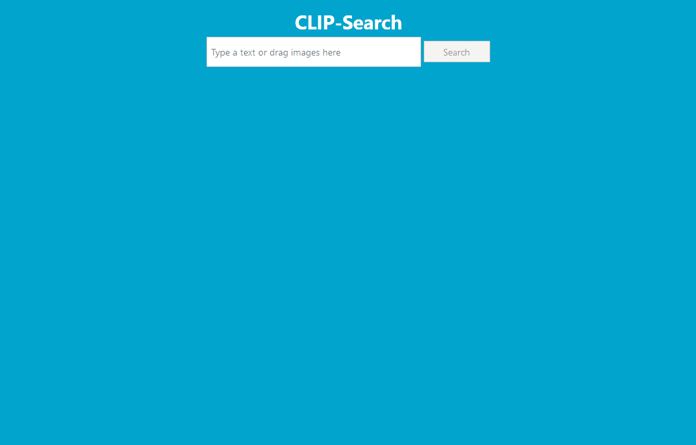

# CLIP-Search

Your private semantic search. No cloud needed!



## Install

The easiest way to install is as follow:

```bash
git clone --recursive https://github.com/brunodoamaral/clip-search.git
cd clip-search

python3 -m venv clip-env
clip-env/bin/pip3 install -r requirements.txt

clip-env/bin/python3 app.py /path/to/my/pictures
````

But it is strongly advised to install using conda:

```bash
git clone --recursive https://github.com/brunodoamaral/clip-search.git
cd clip-search

conda env create -n clip-env -f environment.yml
conda activate clip-env

python app.py /path/to/my/pictures
```

Then point your browser to: http://localhost:5000/index.html

## Usage

The basic usage is to search by text. But you can drag one or more pictures to the search
input in order to find similar images. It will "average" the semantics of all images before
searching.

### More/less like this

Use these buttons to give a hint to the search of which kind of images you are searching
for. Notice that once you click any of these buttons, the image will be hidden from results.
